# Stella User Guide

## Overview

Stella is an AI-powered development workflow system that guides you through the complete software development lifecycle - from planning to implementation, testing, and review. This guide will help you understand how to work with Stella's specialized agents in **Claude Code CLI** to deliver high-quality software efficiently.

**Prerequisites:** All commands in this guide are executed in Claude Code CLI.

---

## BMad-Stella Installation Process

### Prerequisites

Before installing BMad-Stella, ensure you have:

- [ ] **Node.js** installed (v20 or higher)
- [ ] **Claude Code CLI** installed and configured
- [ ] **JIRA account** with access to your organization's instance
- [ ] **Confluence page URL** for architecture documentation (optional but recommended)
- [ ] **Project directory** where you want to install BMad-Stella
- [ ] **Internet connection** for downloading packages

### Step-by-Step Installation

#### Step 1: Run the Installer

Open your terminal and run:

```bash
npx github:Asrarul-BS23/BMad-Stella install
```

#### Step 2: Provide Project Directory

When prompted:

```
?  Enter the full path to your project directory where BMad should be installed:
```

Enter the full path to your project directory where you want to install BMad-Stella.

**Example:** `D:\my-project` or `./home/user/my-project`

#### Step 3: Select BMad Agile Core System

When presented with system options:

```
? Select what to install/update:
```

Select: **BMad Agile Core System**

#### Step 4: Provide Confluence Architecture Docs Link

When prompted:

```
? Enter confluence url of architecture folder:
```

Provide the Confluence page URL containing your project's architecture documentation.

**Example:** `https://yourcompany.atlassian.net/wiki/spaces/PROJ/pages/123456/Architecture`

**Note:** This link will be used by the planner agent to load architecture docs (coding standards, tech stack, git workflow, project structure) during activation.

#### Step 5: Select Claude Code as IDE

When asked about IDE preference:

```
? Which IDE(s) do you want to configure:
```

Select: **Claude Code**

#### Step 6: Skip Web Bundles Installation

When prompted about web bundles:

```
? Would you like to include pre-built web bundles? (Y/n)
```

Enter: **n**

#### Step 7: Configure Atlassian MCP Server

If Atlassian MCP is not already configured, you'll see:

```
? Would you like to configure Atlassian MCP Server now? (Y/n)
```

Enter: **y**

Then provide your JIRA instance URL:

```
? Enter Your JIRA instance URL:
```

Enter: `https://stellaint.atlassian.net` (or your organization's JIRA URL)

**What happens during configuration:**

- MCP server configuration is created
- Authentication is required to connect with JIRA instance

#### Step 8: Complete Installation

You should see:

```
√ Installation complete!

✓ BMad Method installed successfully!


🎯 Installation Summary:
✓ .bmad-core framework installed with all agents and workflows
✓ IDE rules and configurations set up for: claude-code

```

### Post-Installation: Authenticate Atlassian MCP

**IMPORTANT:** Before starting with the planner agent, you must authenticate to the Atlassian MCP server.

#### Authentication Steps:

1. **Open Claude Code CLI** in your project directory

2. **Run MCP authentication command:**

   ```bash
   /mcp
   ```

3. **Navigate to Atlassian:**
   - Select or navigate to the Atlassian MCP server option

4. **Complete authentication:**
   - Follow the authentication when redirected
   - Grant necessary permissions for JIRA and Confluence access

5. **Verify authentication:**
   - Once authenticated, you should see a success message
   - The MCP server status should show as "Connected"

### Troubleshooting Installation

| Issue                                     | Solution                                                            |
| ----------------------------------------- | ------------------------------------------------------------------- |
| **npx command not found**                 | Install Node.js from nodejs.org                                     |
| **Permission denied during installation** | Run with appropriate permissions or use sudo (Unix/Linux)           |
| **Cannot connect to JIRA instance**       | Verify JIRA URL is correct and accessible from your network         |
| **Architecture docs not loading**         | Re-authenticate Atlassian MCP: `/mcp` → Atlassian → Re-authenticate |
| **Agent files not found**                 | Re-run installer: `npx github:Asrarul-BS23/BMad-Stella install`     |

---

## Quick Start

**Environment:** All commands below are executed in **Claude Code CLI**

**⚠️ Important:** Complete the [BMad-Stella Installation Process](#bmad-stella-installation-process) before following this quick start guide.

Every development task follows this core workflow:

```
Planner → Dev → QA → Reviewer
         ↑______(if fixes needed)
```

**Agent Activation (in Claude Code CLI):**

- `/planner` - Activate planning agent
- `/dev` - Activate development agent
- `/qa` - Activate QA/testing agent
- `/reviewer` - Activate review agent

**Must-Use Commands:**

- `*retrieve-ticket-info` - Fetch JIRA ticket details
- `*draft-plan` - Create implementation plan
- `*implement-task` - Execute planned tasks
- `*comment-plan` - Post implementation summary to JIRA (after full completion)
- `*test-design` - Design test scenarios
- `*implement-test` - Write test code
- `*trace` - Map requirements to tests
- `*run-tests` - Execute all tests
- `*review` - Review and optimize code

**Important Optional Commands:**

- `*refine-plan` - Iterate on plan before dev starts
- `*validate-plan` - Validate plan completeness
- `*risk-profile` - Assess risks for complex stories
- `*review-qa` - Apply QA fixes during dev

---

## The Stella Development Workflow

```mermaid
graph TD
    A["Start Development"] --> B["Planner: *retrieve-ticket-info"]
    B --> C["Planner: *draft-plan"]
    C --> D{"High-Risk Story?"}
    D -->|Yes| E["Planner: *risk-profile"]
    D -->|No| F
    E --> F{"Refine Plan?"}
    F -->|Yes| G["Planner: *refine-plan"]
    F -->|Skip| H
    G --> H["Planner: *validate-plan"]
    H --> I{"User Approval"}
    I -->|Needs Changes| C
    I -->|Approved| J{"Design Tests Before Dev? (Recommended)"}
    J -->|Yes| K["QA: *test-design"]
    J -->|Skip for Now| L
    K --> L["Dev: *implement-task"]
    L --> M["Dev: Sequential Task Execution"]
    M --> N["Dev: Complete All Tasks"]
    N --> P{"User Verification"}
    P -->|Request QA Review| S{"Test Design Done?"}
    S -->|No| T["QA: *test-design"]
    S -->|Yes| U
    T --> U["QA: *implement-test"]
    U --> V["QA: *trace"]
    V --> W["QA: *run-tests"]
    W --> X{"QA Decision"}
    X -->|Needs Dev Fixes| Y["Dev: *review-qa"]
    Y --> W1["QA: *run-tests to Verify Fixes"]
    W1 --> X
    X -->|Approved| Z
    P -->|Needs Fixes| M
    P -->|Approve Without QA| Z["IMPORTANT: Verify All Tests Pass"]
    Z --> AA["Reviewer: *review"]
    AA --> AB{"Reviewer Finds Issues?"}
    AB -->|Yes| AC["Reviewer: Apply Improvements Directly"]
    AC --> AD["QA: *run-tests to Verify"]
    AD --> AA
    AB -->|No Issues| AE["Dev: *comment-plan + Mark Ticket Complete"]
    AE --> A

    style A fill:#f5f5f5,color:#000
    style B fill:#e8f5e9,color:#000
    style C fill:#e8f5e9,color:#000
    style D fill:#e3f2fd,color:#000
    style E fill:#ffd54f,color:#000
    style F fill:#e3f2fd,color:#000
    style G fill:#e8f5e9,color:#000
    style H fill:#e8f5e9,color:#000
    style I fill:#e3f2fd,color:#000
    style J fill:#e3f2fd,color:#000
    style K fill:#ffd54f,color:#000
    style L fill:#e3f2fd,color:#000
    style M fill:#e3f2fd,color:#000
    style N fill:#e3f2fd,color:#000
    style P fill:#e3f2fd,color:#000
    style S fill:#e3f2fd,color:#000
    style T fill:#ffd54f,color:#000
    style U fill:#ffd54f,color:#000
    style V fill:#ffd54f,color:#000
    style W fill:#ffd54f,color:#000
    style W1 fill:#ffd54f,color:#000
    style X fill:#e3f2fd,color:#000
    style Y fill:#e3f2fd,color:#000
    style Z fill:#ff5722,color:#fff
    style AA fill:#f9ab00,color:#fff
    style AB fill:#e3f2fd,color:#000
    style AC fill:#f9ab00,color:#fff
    style AD fill:#ffd54f,color:#000
    style AE fill:#34a853,color:#fff
```



---

## Common Workflows

**Note:** All commands below are executed in **Claude Code CLI**.

### Workflow 1: Standard Feature Development

```bash
# 1. Planning Phase (in Claude Code CLI)
/planner
*retrieve-ticket-info PROJ-123
*draft-plan {ticket-file}
# For complex/high-risk stories, add risk assessment:
# *risk-profile bmad-docs/impl-plan/PROJ-123-plan.md
*validate-plan bmad-docs/impl-plan/PROJ-123-plan.md

# 2. Optional: Design Tests Before Development (Recommended)
/qa
*test-design bmad-docs/impl-plan/PROJ-123-plan.md

# 3. Development Phase
/dev
*implement-task
# (repeat for each task until all complete)

# 4. Testing Phase
/qa
# If test design not done earlier, do it now:
# *test-design bmad-docs/impl-plan/PROJ-123-plan.md
*implement-test bmad-docs/impl-plan/PROJ-123-plan.md
# After tests are implemented, create traceability matrix:
*trace bmad-docs/impl-plan/PROJ-123-plan.md
# After trace confirms coverage, run tests:
*run-tests

# 5. Review Phase
/reviewer
*review bmad-docs/impl-plan/PROJ-123-plan.md
# Reviewer applies improvements directly if issues found

# 6. Verify Improvements (if reviewer made changes)
/qa
*run-tests
# If tests pass, proceed to completion

# 7. Mark Complete and Update JIRA
/dev
*comment-plan bmad-docs/impl-plan/PROJ-123-plan.md
# Mark ticket as complete
```

### Workflow 2: Bug Fix with QA Feedback Loop

```bash
# 1. Planning (in Claude Code CLI)
/planner
*retrieve-ticket-info BUG-789
*draft-plan {ticket-file}
*validate-plan bmad-docs/impl-plan/BUG-789-plan.md

# 2. Optional: Design Tests Before Fix (Recommended)
/qa
*test-design bmad-docs/impl-plan/BUG-789-plan.md

# 3. Initial Fix
/dev
*implement-task

# 4. QA Testing
/qa
*implement-test bmad-docs/impl-plan/BUG-789-plan.md
# After tests are implemented, create traceability matrix:
*trace bmad-docs/impl-plan/BUG-789-plan.md
# After trace confirms coverage, run tests:
*run-tests
# Tests fail - QA provides feedback

# 5. Apply QA Fixes
/dev
*review-qa
# Dev makes corrections based on QA feedback

# 6. Re-run QA Validation
/qa
*run-tests
# Verify fixes resolve issues

# 7. Review
/reviewer
*review bmad-docs/impl-plan/BUG-789-plan.md
# Reviewer applies improvements directly if issues found

# 8. Verify Improvements (if reviewer made changes)
/qa
*run-tests
# If tests pass, proceed to completion

# 9. Mark Complete and Update JIRA
/dev
*comment-plan bmad-docs/impl-plan/BUG-789-plan.md
# Mark ticket as complete
```

---

## Best Practices

### Planning Phase

1. **Always retrieve ticket info first** - Don't skip straight to planning
2. **Use risk-profile for complex stories** - Better to assess risks early
3. **Validate plans before handoff** - Saves time in development
4. **Refine based on feedback** - Iteration improves plan quality
5. **Include detailed acceptance criteria** - Makes testing easier

### Development Phase

1. **Follow the plan exactly** - It contains all necessary context
2. **Implement tasks sequentially** - Don't skip ahead
3. **Write tests as you go** - Don't defer testing to the end
4. **Run validations after each task** - Catch issues early
5. **Update File List continuously** - Maintain accurate change tracking
6. **Ask questions when blocked** - Don't fail silently
7. **Mark tasks complete as you go** - Update plan checkboxes after each task

### Testing Phase

1. **Design tests before implementation (Recommended)** - Guides development and ensures testability
2. **Follow correct sequence** - `*test-design` → `*implement-test` → `*trace` → `*run-tests`
3. **Never skip trace** - Always run `*trace` after test implementation to verify coverage before running tests
4. **Prioritize critical paths (P0)** - Test must-haves first
5. **Implement tests in priority order** - P0 → P1 → P2 → P3
6. **Run full test suite** - Including regression tests after trace confirms coverage
7. **Document gaps clearly** - Help dev address issues

### Review Phase

1. **Reviewer applies fixes directly** - No need to loop back to dev
2. **Focus on real improvements** - Not theoretical optimizations
3. **Prioritize performance** - Time complexity matters
4. **Keep changes simple** - Avoid over-engineering
5. **Always run tests after changes** - Use `/qa` then `*run-tests` to verify improvements

---

## Troubleshooting

| Issue                                       | Cause                                                                                             | Solution                                                                                                                                               |
| ------------------------------------------- | ------------------------------------------------------------------------------------------------- | ------------------------------------------------------------------------------------------------------------------------------------------------------ |
| **Cannot retrieve ticket or post comments** | Atlassian MCP authentication failed                                                               | /mcp → Navigate to Atlassian → Re-authenticate → Confirm JIRA URL format and ticket access                                                             |
| **Agent cannot find plan file**             | Plan file path incorrect or not created                                                           | Ensure plan exists in `bmad-docs/impl-plan/{TICKET}-plan.md` → Provide full path                                                                       |
| **Tests failing during validation**         | Implementation mismatch or incorrect test scenarios                                               | Review test failure messages → Verify implementation matches requirements → Use `/dev` then `*review-qa` → Use `/qa` then `*run-tests` to verify fixes |
| **Dev agent HALTs**                         | Unapproved dependency, ambiguous requirements, 3+ failures, missing config, or failing regression | Address blocking issue (approve dependency, clarify requirements, provide config, fix tests) → Resume                                                  |
| **`*run-tests` shows no tests**             | Test design or implementation not completed                                                       | Run `/qa` → `*test-design` → `*implement-test` → Then `*run-tests`                                                                                     |
| **Architecture docs not loading**           | Atlassian MCP not authenticated or incorrect Confluence URL                                       | `/mcp` → Atlassian → Re-authenticate → Verify Confluence URL in core-config.yaml → Re-run `/planner` activation                                        |
| **Agent commands not recognized**           | BMad-Stella not installed or installed incorrectly                                                | Follow Installation Process section → Run `npx github:Asrarul-BS23/BMad-Stella install`                                                                |

---

## Command Reference

**Note:** All commands listed below are executed in **Claude Code CLI**.

### Planner Agent Commands

**Activation (in Claude Code CLI):** `/planner`
**Agent:** Alex - Senior Implementation Planner
**Icon:** 🎯

| Command                 | Purpose                                                                              | When to Use                                                                                                                                                                                            | Files Created/Modified                                                   | Parameters                                                                                |
| ----------------------- | ------------------------------------------------------------------------------------ | ------------------------------------------------------------------------------------------------------------------------------------------------------------------------------------------------------ | ------------------------------------------------------------------------ | ----------------------------------------------------------------------------------------- |
| `*help`                 | Display all available commands                                                       | When starting planner agent or need command list                                                                                                                                                       | None                                                                     | None                                                                                      |
| `*retrieve-ticket-info` | Fetch JIRA ticket details via Atlassian MCP                                          | **First step** in planning workflow. Use when you have a JIRA ticket number or URL and need to gather requirements, acceptance criteria, and attachments before planning                               | None (displays ticket info for validation)                               | `{ticket-number-or-url}` - JIRA ticket ID (e.g., PROJ-123) or full URL                    |
| `*draft-plan`           | Create detailed implementation plan with tasks, technical approach, and dependencies | After retrieving ticket info and validating requirements. Transforms ticket into actionable plan with step-by-step tasks that junior developers can follow                                             | **Creates:** `bmad-docs/impl-plan/{TICKET-NUMBER}-plan.md`               | `{ticket-file-or-description}` - Ticket file path or description with Acceptance Criteria |
| `*refine-plan`          | Iterate and improve existing implementation plan                                     | When initial plan needs more technical detail, user provides feedback, requirements change, or approach needs adjustment. Supports iterative refinement before dev handoff                             | **Modifies:** Existing plan file                                         | `{plan-file}` - Path to implementation plan                                               |
| `*validate-plan`        | Run validation checklist on plan completeness                                        | Before handing off to dev agent. Ensures plan has all required sections, clear acceptance criteria, detailed tasks, identified dependencies, and technical decisions documented                        | None (displays validation results)                                       | `{plan-file}` - Path to implementation plan                                               |
| `*risk-profile`         | Generate risk assessment matrix with mitigation strategies                           | For complex/high-risk stories: database migrations, schema changes, breaking API changes, multi-integration features, security-sensitive implementations, or stories affecting critical business flows | **Creates:** Risk assessment section in plan or separate assessment file | `{story}` - Story/plan reference                                                          |
| `*exit`                 | Exit planner agent mode                                                              | When planning phase is complete and plan is validated                                                                                                                                                  | None                                                                     | None                                                                                      |

---

### Dev Agent Commands

**Activation (in Claude Code CLI):** `/dev`
**Agent:** Bob - Full Stack Developer
**Icon:** 💻

| Command           | Purpose                                        | When to Use                                                                                                                                                                                                                                                     | Files Created/Modified                                                                                                                                         | Parameters                                    |
| ----------------- | ---------------------------------------------- | --------------------------------------------------------------------------------------------------------------------------------------------------------------------------------------------------------------------------------------------------------------- | -------------------------------------------------------------------------------------------------------------------------------------------------------------- | --------------------------------------------- |
| `*help`           | Display all available commands                 | When starting dev agent or need command list                                                                                                                                                                                                                    | None                                                                                                                                                           | None                                          |
| `*implement-task` | Execute implementation plan tasks sequentially | **Primary development command.** Use when you have an approved implementation plan and are ready to code. Implements one task at a time, writes tests, runs validations, and HALTs between tasks for user approval                                              | **Modifies:** Implementation plan (checkboxes, Dev Agent Record, Change Log, Status). **Creates/Modifies:** Source code files, test files as specified in plan | None (reads from current implementation plan) |
| `*comment-plan`   | Post implementation summary to JIRA ticket     | **ONLY after ticket implementation is FULLY done** - all tasks completed with [x], all validations pass, code complete. Posts formatted comment with completed tasks, technical summary, and acceptance criteria (if not in ticket) to update JIRA stakeholders | None (posts comment to JIRA)                                                                                                                                   | `{plan-file}` - Path to implementation plan   |
| `*review-qa`      | Apply fixes based on QA feedback               | When QA agent identifies bugs, test failures, coverage gaps, or issues during testing. Systematically addresses QA feedback. After fixes, must run `/qa` then `*run-tests` to verify corrections                                                                | **Modifies:** Source code files, test files, implementation plan Debug Log                                                                                     | None (reads QA feedback from plan)            |
| `*explain`        | Provide detailed explanation of implementation | When you want to learn and understand what was implemented, why certain decisions were made, and how code works. Educational tool for knowledge transfer                                                                                                        | None                                                                                                                                                           | None                                          |
| `*exit`           | Exit dev agent mode                            | When development phase is complete or switching agents                                                                                                                                                                                                          | None                                                                                                                                                           | None                                          |

**CRITICAL Dev Rules:**

- ONLY updates plan checkboxes, Dev Agent Record (Agent Model, Debug Log, Completion Notes, File List), Change Log, and Status
- NEVER modifies Requirements, Technical Approach, Acceptance Criteria, or other planning sections
- HALTS for: unapproved dependencies, ambiguous requirements, 3+ consecutive failures, missing config, failing regression tests
- Requires user confirmation before: DB migrations, building project, creating models without clear specs

---

### QA Agent Commands

**Activation (in Claude Code CLI):** `/qa`
**Agent:** Quinn - Test Architect & Implementation Specialist
**Icon:** 🧪

| Command           | Purpose                                                               | When to Use                                                                                                                                                                                                                                                    | Files Created/Modified                                                                                                                   | Parameters                                  |
| ----------------- | --------------------------------------------------------------------- | -------------------------------------------------------------------------------------------------------------------------------------------------------------------------------------------------------------------------------------------------------------- | ---------------------------------------------------------------------------------------------------------------------------------------- | ------------------------------------------- |
| `*help`           | Display all available commands                                        | When starting QA agent or need command list                                                                                                                                                                                                                    | None                                                                                                                                     | None                                        |
| `*test-design`    | Design comprehensive test scenarios with priority levels              | **Recommended:** After plan validation, BEFORE dev starts (guides implementation and ensures testability). **Alternative:** After implementation completes. Designs test scenarios covering happy paths, edge cases, error conditions with P0-P3 priorities    | **Creates:** `bmad-docs/qa/assessments/test-design-{TICKET}.md`                                                                          | `{plan-file}` - Path to implementation plan |
| `*implement-test` | Write actual test code from test scenarios                            | After `*test-design` creates scenarios. Implements tests in priority order (P0→P1→P2→P3), following project testing conventions. HALTs after each priority group for validation                                                                                | **Creates/Modifies:** Test files in project test directories (unit/integration tests). **Modifies:** Implementation plan Testing section | `{plan-file}` - Path to implementation plan |
| `*trace`          | Create requirements traceability matrix mapping requirements to tests | **ONLY after `*implement-test` completes** - requires actual test files to exist. Maps all requirements to implemented tests using Given-When-Then format, identifies coverage gaps and untested requirements. Must run before `*run-tests` to verify coverage | **Creates:** `bmad-docs/qa/assessments/trace-{TICKET}.md`                                                                                | `{plan-file}` - Path to implementation plan |
| `*run-tests`      | Execute all tests (linting, unit, integration, regression)            | **CRITICAL:** ONLY use AFTER both `*test-design` AND `*implement-test` are complete. Runs full test suite and reports pass/fail status with detailed results                                                                                                   | None (displays test results)                                                                                                             | None                                        |
| `*exit`           | Exit QA agent mode                                                    | When testing phase is complete or switching agents                                                                                                                                                                                                             | None                                                                                                                                     | None                                        |

**IMPORTANT Test Workflow:**

1. **Recommended Flow:** `/qa` → `*test-design` (before dev) → `/dev` implements → `/qa` → `*implement-test` → `*trace` → `*run-tests`
2. **Alternative Flow:** `/dev` implements → `/qa` → `*test-design` → `*implement-test` → `*trace` → `*run-tests`
3. **Critical Sequence:** Must run in exact order: `*implement-test` → `*trace` → `*run-tests`
4. **Never skip:** `*trace` after test implementation - it validates coverage before running tests

**Test File Locations:**

- Unit tests: Typically alongside source files or in parallel test directory structure
- Integration tests: Dedicated integration test directory
- Follows conventions in `bmad-docs/architecture/technical-preferences.md`

---

### Reviewer Agent Commands

**Activation (in Claude Code CLI):** `/reviewer`
**Agent:** Morgan - Code Reviewer & Optimizer
**Icon:** 🔍

| Command   | Purpose                                               | When to Use                                                                                                                                                                                                                                                                                                                                                                  | Files Created/Modified                                                                | Parameters                                                      |
| --------- | ----------------------------------------------------- | ---------------------------------------------------------------------------------------------------------------------------------------------------------------------------------------------------------------------------------------------------------------------------------------------------------------------------------------------------------------------------- | ------------------------------------------------------------------------------------- | --------------------------------------------------------------- |
| `*help`   | Display all available commands                        | When starting reviewer agent or need command list                                                                                                                                                                                                                                                                                                                            | None                                                                                  | None                                                            |
| `*review` | Review code and apply practical improvements directly | After dev and QA phases complete, all tests pass. **Reviewer identifies issues and applies fixes directly** without looping back to dev. Finds and applies real improvements: time complexity reduction (O(n²)→O(n)), algorithmic inefficiencies, readability issues, code structure problems. After making changes, must run `/qa` then `*run-tests` to verify improvements | **Modifies:** Source code files with optimizations. May update plan with review notes | `{plan-or-file}` - Path to implementation plan or specific file |
| `*exit`   | Exit reviewer agent mode                              | When review phase is complete or done with optimizations                                                                                                                                                                                                                                                                                                                     | None                                                                                  | None                                                            |

**Review Focus Areas:**

- **Time Complexity:** Reducing algorithmic complexity (e.g., nested loops → hash maps)
- **Algorithmic Efficiency:** Eliminating redundant operations, unnecessary iterations
- **Code Readability:** Improving variable names, function structure, clarity
- **Best Practices:** Ensuring adherence to project coding standards

**What Reviewer AVOIDS:**

- Theoretical improvements without measurable impact
- Complex solutions (caching layers, vector embeddings, infrastructure changes)
- Over-engineering for hypothetical future requirements

**Important:** Reviewer applies improvements directly. After changes, run `/qa` then `*run-tests` to verify.

---

### File Creation Summary

**By Planner Agent:**

```
bmad-docs/
├── impl-plan/
│   └── {TICKET-NUMBER}-plan.md       # Detailed implementation plan with tasks
└── architecture/                      # Loaded on activation from Confluence
    ├── coding-standards.md
    ├── tech-stack.md
    ├── git-workflow.md
    └── project-structure.md
```

**By Dev Agent:**

- Modifies: `bmad-docs/impl-plan/{TICKET-NUMBER}-plan.md` (checkboxes, Dev Agent Record, Change Log)
- Creates/Modifies: Source code files, test files as per implementation plan

**By QA Agent:**

```
bmad-docs/qa/assessments/
├── test-design-{TICKET}.md           # Test scenarios with priorities
└── trace-{TICKET}.md                 # Requirements traceability matrix
```

Plus: Test files in project test directories

**By Reviewer Agent:**

- Modifies: Source code files with optimizations. May update plan with review notes

**Key Configuration:**

```
.bmad-core/
└── core-config.yaml                  # Project configuration
```

---

## Tips for Success

1. **Trust the workflow** - Each phase builds on the previous one
2. **Use must-use commands** - They're required for a reason
3. **Don't skip validation** - Catching issues early saves time
4. **Keep JIRA updated** - Use `*comment-plan` ONCE when ticket is fully complete
5. **Ask for help** - Every agent has a `*help` command
6. **Iterate when needed** - Use refine-plan, review-qa as needed
7. **Run all tests** - Including regression before marking done
8. **Document changes** - File List and Change Log matter
9. **Review before completion** - Final review catches optimizations
10. **Follow agent guidance** - Agents HALT when user input is needed

---

## Getting Started Checklist

- [ ] Complete BMad-Stella installation (see Installation Process section above)
- [ ] Authenticate Atlassian MCP server with `/mcp` command
- [ ] Verify JIRA access and permissions
- [ ] Confirm architecture docs loaded successfully
- [ ] Review project architecture docs location in core-config.yaml
- [ ] Understand your project's testing conventions
- [ ] Open your project in Claude Code CLI
- [ ] Start with `/planner` command for your first ticket
- [ ] Follow the workflow: planner → dev → qa → reviewer
- [ ] Use must-use commands for each phase
- [ ] Run all tests before marking complete
- [ ] Review code for optimizations
- [ ] Post final summary to JIRA with `*comment-plan` when ticket is complete
- [ ] Mark ticket as done

---

## Support and Resources

- **Installation Issues:** See BMad-Stella Installation Process and Troubleshooting Installation sections
- **MCP Authentication:** Use `/mcp` command in Claude Code CLI to authenticate or re-authenticate
- **Agent Commands:** Use `*help` in any agent mode to see available commands
- **Workflow Guidance:** Reference this guide when unsure of next steps
- **Decision Making:** Check agent persona sections for decision-making principles
- **Visual Reference:** Review mermaid diagram for workflow visualization
- **File Templates:** Consult implementation plan template for expected structure

---

**Remember:** Stella works best when you follow the structured workflow. Start with planning, develop systematically, test comprehensively, and review critically. Each phase ensures quality and reduces rework.

Happy coding with Stella!
